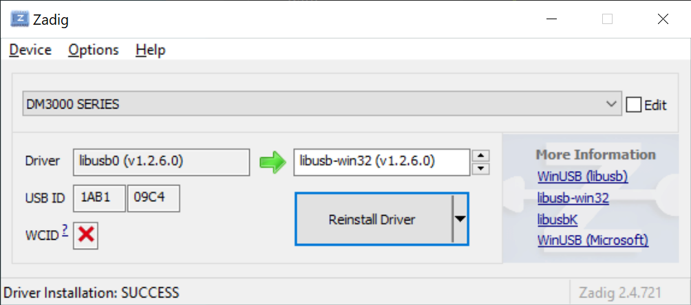

# EdPro toolchain

Binary software and packages required for development, testing and calibration.
This repository should be checked out alongside with other projects (firmware, multimeter, powersource).

- `./xtensa-lx106-elf` - c/c++ compiler for embedded sowftware
- `./python` - python interpreter with all necessary packages

# Install drivers:

## Multimeter & Powersource UART driver:
* Install from `downloads\CP210x_Universal_Windows_Driver.zip`

## RIGOL DM3058 Multimiter:

* Connect device
* Use `zadig` tool (downloads\zadig-2.4.zip) to set driver:
    * run `zadig`
    * choose device: `DM3000 SERIES`
    * choose driver: `libusb-win32 (v1.2.6.0)`
    * click `Install Driver`

## OWON AG051 Signal Generator:

* Turn off or disconnect all other OWN devices!
* Turn on OWON AG051 device
* Install OWON Ultrawave: `.\downloads\AG051_Waveform_Generator\OWON_ultrawave.zip`
* Find `AG051` in Device Manager
* Manually update driver from: `C:\Program Files (x86)\OWON\ultrawave\USBDRV`
* Launch **ultrawave** from the Desktop shortcut, choose `menu > Communications > CommandLine`, ensure it works.

## OWON ODP-3031 Power Supply:

* Turn off or disconnect all other OWN devices!
* Turn on OWON ODP3031 device
* Install ODP software: `.\downloads\ODP3031_Power_Supply\OWON_ODP3031_Setup.zip`
* Launch **ODP** from desctop shortcut and ensure it works:
    * `menu > Communications > Port-Settings`, choose USB device
    * `menu > Communications > Connect`
    * `menu > Communications > Disconnect`

## EdPro Production tester:

* Connect board.
* Install UARD driver: `downloads\CH34x_Install_Windows_v3_4.zip`
* Run in **Git Bash** shell `amperia\amp-firmware\devboard.sh`
* Check it works: `Device > Console`

# Test all devices setup:

* Connect all devices (ROGOL Multimeter, OWON Generator, OWON Powersource) wit devboard.
* OWON Powersource: turn on both output channels.
* Run in **Git Bash** shell `amperia\amp-firmware\devboard.sh`

### Test:
